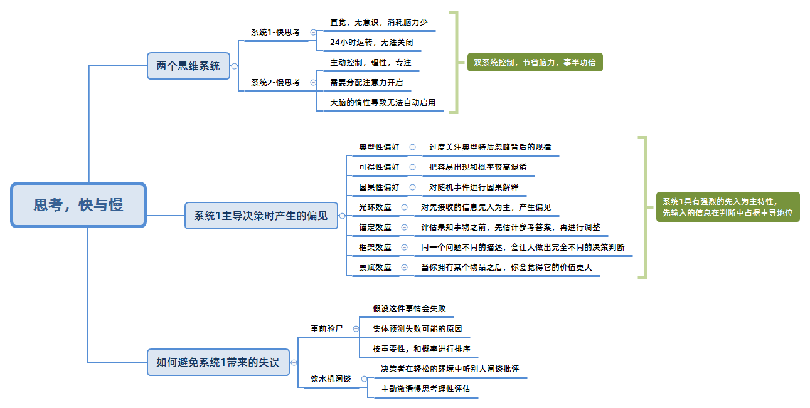

## 历史记录

| 版本 | 修订日期   | 修订者 | 修订内容                   |
| ---- | ---------- | ------ | -------------------------- |
| 0.1  | 2023-11-12 | 周培豪 | 整理《思考的快与慢》读后感 |

书中说，人有两种思维系统，如书名，快的思维系统就像人的直觉思维，慢的思维系统就是人的理性思维。

快思考的特点是脑力的消耗很少，一般是非理性的意识主导的，容易出错，容易受到情绪的影响，所以快思考的结果往往不可靠。先入为主，全天运行，不会停止。

慢思考的特点是脑力的消耗很大，一般是理性的意识主导的，需要专注，需要分配你很多的注意力，所以你要主动的控制。惰性使然，不能自动触法，只能手动触发。

<!-- more -->

## 快思考与慢思考

快思考是大脑的自动反应模式，它会使生活简化，‍‍让我们不必每天早上起来都思考一遍，如何套上衣服、扣纽扣、挤牙膏，‍‍它可以节省我们日常生活中的脑力损耗，它可以快速的反应出来简单的加减法 比如 2 + 9 = 11。

然而之所以这些简单的加减法，我们可以快速的反应出来，是因为我们在小学的时候，就已经通过大量的练习，把这些简单的加减法，变成了我们的习惯，变成了我们的本能，变成了我们的直觉，变成了我们的快思考。

在它们变成快思考之前，比如复杂的 99 * 123 = 12277，我们需要通过慢思考，才能得出正确的答案。所有无法立刻给出答案的事儿都会移交给慢思考处理，当慢思考接到快思考的求助后，‍‍会将大脑的注意力分配到快思考碰到的困难上，集中精力处理这些问题。

慢思考十分谨慎，具有推理能力，它运作得出的结论往往比快思考更靠谱。但是慢思考是非常懒惰的，‍‍它通常不会主动干预快思考的工作，除非快思考发出求助，‍‍这就决定了我们在处理事情的时候，‍‍总是快思考先出面，而不能绕过快思考，直接启动慢思考。‍

这种配合模式使它们协作非常高效，能花最少的力气解决问题的时候，‍‍绝不会多费一份脑力，这听起来很美好，然而快思考却有个毛病，‍‍虽然它在很多时候会提供正确的判断，但在一些特定的环境中却很容易出错，‍‍这些环境就是我们的生活环境，‍‍因为我们的生活环境是复杂多变的，‍‍而快思考的判断是基于过去的经验，‍‍而过去的经验并不一定适用于现在的环境，‍‍所以快思考的判断往往是错误的。

快思考虽然属于你自己，‍‍你却没有办法完全的关掉它，你最多只能用慢思考去纠正压制住它。‍‍比如你带着对象去电影院看恐怖片的时候，哪怕你的慢思考会告诉你对象，‍‍这些恐怖的场面都是假的，这是电影不用害怕，然后你对象的快思考会不停的给你发出信号，太恐怖了然后各种尖叫起来，之后躲进你怀里。‍‍不过你带着你的对象去电影院看恐怖电影多了，你对象的慢思考逐渐会纠正她的快思考，‍‍她就不会再那么害怕了。‍‍

在人类的决策行为模式中，快思考和慢思考都会发挥着作用，‍‍但是由于慢思考的懒惰，很多时候快思考会占据主导地位，人的直觉就是快思考的思考模式，‍‍通常会导致我们的思维过程出现许多的偏见和失误。‍‍

## 快思考决策偏见和失误（三种偏好和四种效应）

三种偏好和四种效应也叫快思考的七条缺陷。

1. 典型型偏好：过度关注典型特质的案例而忽略实际背后的规律，获得以偏概全自以为是的答案。
2. 可得性偏好：过度关注容易想起的信息而忽略不容易想起的信息，心浮气躁的想要快速获得答案。
3. 因果性偏好：对随机事件进行事实因果的解释，从而快速的得到“胡说八道”的答案。
4. 光环效应：对接受的信息，采取先入为主，从而产生偏见，不会结合后面的信息去综合判断。
5. 锚定效应：对于未知的事物，会根据已知的事物进行比较，从设定锚定值，以此为基准进行判断。其实此时你的思想就被固定在“锚点”上。
6. 框架效应：同一个问题，不同的表述方式，会导致不同的决策判断。唬人或被唬的时候，就会能遇到。
7. 损失厌恶和禀赋效应：损失厌恶是指损失给人带来的痛苦比获得给人带来的快乐要大得多。因为损失厌恶，所以人们对自己拥有的东西更加难以割舍，失去就成倍痛苦，这就是禀赋效应。

## 进化出好的思考模式

快思考是具有先入为主的特性，先输入的信息会在判断中占据主导地位，从而很大程度上影响你的判断。

慢思考是懒惰的，如果能使它变得勤快起来，那么它就能让快思考变得更加靠谱。

想让慢思考勤快起来，则需要“提示”，提示就是让慢思考主动的介入，从而纠正快思考的错误。可以是自我提示，也可以是外部提示。

自我提示就像是闹钟，外部提示就像是朋友的主动提醒。对不少人的心理特征而言，自己想睡懒觉，闹钟是没有用的，而外部提示相较于闹钟，更加有效。

这也是当局者迷旁观者清，因为旁观者会用他们的慢思考来纠正你快思考中的失误和错误。所以当你遇到问题时，借助旁观者的慢思考，通过讨论的方式，还是挺有意义的。

事前验尸：在做决策之前，先假设这件事情将来会失败，再分析这件事情失败的可能原因，然后按照权重和概率对这些原因进行排序，最后再对这些原因进行预防和应对。这也像是风险评估，目的就是为了预防和应对未来可能会发生的危机。如此一来便可提高决策的成功率，不至于被想要胜利的念头冲昏头脑。

## 总结

快思考是直觉系统，慢思考是非直觉系统。由于慢思考的懒惰，现实生活中，快思考往往会成为思考和决策的主宰者。

快思考的直觉会导致快思考导致一系列偏见和失误，从而使得思考和决策面临风险。

可以通过 旁观者清、事前验尸来放慢思考，主动激活慢思考，对快思考的直觉解决进行理性的检验，减少偏见和失误。

本质就是去 通过学习这本书中的内容，清楚有效的思考方式，从而抑制思维上的一些偏见，去减少不理智且荒诞的行为。

不过人有时觉得自己十分理智，但也会去做出十分荒诞的事情。所以得主动的去激活慢思考，有效的减少偏见和失误。

