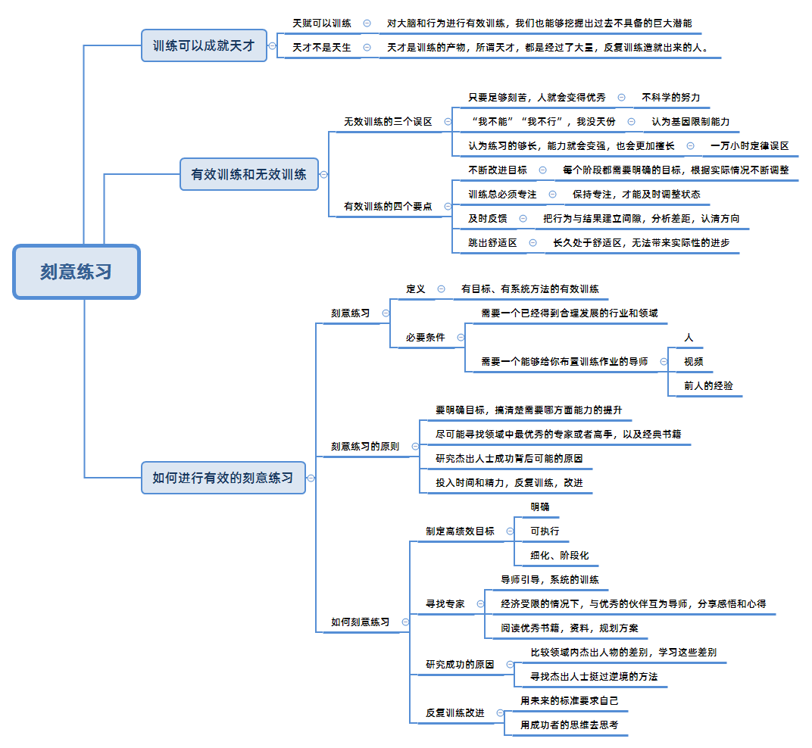

## 历史记录

| 版本 | 修订日期   | 修订者 | 修订内容               |
| ---- | ---------- | ------ | ---------------------- |
| 0.1  | 2023-11-20 | 周培豪 | 整理《刻意练习》读后感 |

书中说，杰出并非是一种天赋，也不全是与生俱来的，而是人人可以学习的技巧，而这种技巧的关键就是刻意练习。

刻意练习这本书就是一本指导实践的好书，描述了刻意练习的原理以及实践的方法，是一种关于人类潜力的新思考方式，从而提醒你拥有更大的力量去掌控自己的人生，因为这是你过去没有意识到的。

痛点：沉迷学习无法自拔却收效甚微，工作多年却依然没有明显的长进。

<!-- more -->

## 有效与无效的训练

黄金标准：  
有效的训练是一种刻意练习，它是一种专注的、有目的的、反馈及时的、挑战性的、不断重复的练习。

天真练习：  
反复的做某件事情，并指望依靠这种重复就能提高表现和水平，这就是无效的练习。  
生活中一般人学习和练习一种技能都是采用这种天真的重复练习法，导致付出与收获不成正比。

### 无效训练的三个误区

要拒绝以下三种错误的思想，这三种错误的思想会让你忽略方法的重要性，陷入无用努力的死循环，只有摆脱对天赋和努力错误的认知，才能真正的开始，可以练习不断的进步。其次找到一位好的导师，是提高任何技能最快的一个方式。

不科学的努力。不是足够刻苦，人就会变的优秀。现实是所有的事情，尤其是专业化的技能，除非你运用一些特定的练习方法，否则即使加倍努力，也不会有更大的进步。

打从心底觉得基因限制能力。认为自己没天分，自己不行，自己不能。比如 自我否定，我不能管理好别人，我做不到比这更好等等。实际上，人人都可以通过正确的训练来帮助提高塑造自己的潜力。

认为重复练习一万小时就能成为大师。认为练习的够长，能力就会变强，也会更加擅长。实际上一而再再而三的做某件事情，并不是提高绩效和表现的秘诀，它会使人们停下前进的脚步，并且缓慢的下滑。

### 有效训练的四个要点

每个阶段都需要明确自己的目标，根据实际情况来不断调整，不断的改进目标。

保持专注，才能及时调整状态，训练最需要专注。

把行为与结果建立联系，找出间隙，分析差距，认清方向，要及时反馈。

长久处于舒适区，没法带来实际性的进步，得跳出舒适区。

## 刻意练习

刻意练习，它的本质是把短时间记忆转化成长时间记忆，是需要明确的目标，有反馈的专注的练习，可以先简单的做有目的的练习，要努力去做一些自己难以做到的事情，完成一些舒适区以外的任务。

### 可执行可量化的目标

稳步前进目标要可执行可量化，你要实现哪方面的能力提升就要先定一个短期的具体目标，将目标拆分成一个个小的目标，然后把目标转化成具体可以实施、调整、优化的步骤，积累小胜利变成大胜利，一步一步前进，始终保持充沛的热情，有效的引导你进行练习，从而达到稳定的进步。

就像爬山，虽然你最终是要爬到最高的山顶，如果一开始我们就把目标定在高耸入云的山。在艰难的攀爬中，可能会慢慢的丧失信心，还未到达山腰就失望的放弃了。如果一开始不是将目标定在山巅，而是定在山脚的某个山头，那么你就会一鼓作气的征服这个山头，尝到甜头后，就会满怀信心的去征服另一个更高的山头，也许最后你到达巅峰的时间推迟了，但你收获的快乐远比别人的多。

生活中有很多事情都是如此看着很难过，把它们拆分成若干小部分，这样实行起来就容易得多来，所以我们应该给自己定一个看得见摸得着的目标，目标的设定一定不能超过自己的能力太多，在攻克一个目标后就会收获到成功的喜悦，进而建立起自信，有了自信心就会有克服困难的勇气，有了勇气就能逐步的迈向成功。

### 集中注意力全力练习

有两个看书的学生，一个人看到半夜书就刷一下手机，看看窗外发发呆，另一个人看书时把手机静音专心致志的读，并且做笔记，输出感想，这两种阅读效果肯定不同，想想看谁的进步会更快，毫无疑问是后者。

因为要想取得进步，必须完全把注意力集中到你的任务上，只有足够的专注，你才能保证每一次行动的正确，每一个细节都做到卓越，最终能成为根深蒂固的习惯。

村上春树在写作之初，练习的目标就是培养自己的专注力，而不太在意文章的长短和质量的忧虑，只是坚持去集中精力的写作，花费足够的时间。
让自己对于写作的耐力得到最大程度的强化，当习惯养成之后，才逐渐摸索出写作的方法和技巧，最终又通过反复练习，形成自己独有的风格，让文字褪去原始的青涩和肤浅，变得深刻和成熟。

乔布斯也说过专注一致是他成功的秘诀，专注一件事并做到极致，你就会成功。

明确自己的目标之后，找一个安静的环境，远离没有帮助的电子产品，找到目前对你来说最紧急最重要的事情，把精力集中在你手头这件事情上，全身心投入，你会发现你的效率会提升很多。

### 通过及时反馈获取成效

不论你在努力做什么事情都需要反馈，来准确的判别。在哪些方面还有什么不足，以及怎么会存在这些不足？如果没有反馈，你不可能搞清楚你在哪些方面还需要提高，或者现在你离你要实现的目标还有多远。有反馈才能知道自己哪里做错了，哪里做对了，好的反馈意见可以帮助你及时纠正错误，始终保持在正确的练习方向上前进。

参加一些资格考试，每学习一段知识，就应该做题，反馈学习效果，如果做错了，就要找出原因，然后再去学习，再去做题，直到做对为止，这样才能保证你的学习效果。

学习编程，从最简单最能见到的成效来学起，不断创造成就感。

练习写作，就参加一个社群或者培训班，让大家点评，发现不足的地方。

在工作和生活中，要想通过刻意练习，实现持续的进步提高，就要进行及时反馈，寻求反馈的方式和途径。

一方面，要多借科学先进的工具和手段，以客观记录反映练习的过程和效果。另一方面，多寻求老师，领导同事和家人朋友的帮助。  
更加重要的是要虚怀若谷，保持学习交流的开放心态，虚心接受反馈。无论是正面或者是负面的反馈都应该正确对待，有则改之，无则加勉。从而提出针对性的改进措施，实现成长的目标。

### 走出舒适区 跨越瓶颈

追求舒适是人类的天性，舒适区也是造成一生平庸的元凶，迫使自己走出舒适区是刻意练习中十分重要的部分。

打个比方，一个非常有天赋的足球爱好者，在场上的水平也比不上一个受过训练的足球运动员，即使这个受过训练的足球运动员天资平庸。  
因为足球爱好者纯粹是为了乐趣而踢球，他们享受踢球的过程，他们渴望的是下班后去足球场把脚怒射排解郁闷，所以他们会停留在舒适区，按照自己熟悉的方式贴着让自己舒服的足球。  
而足球运动员可不是这样，他们会被要求在自己最不擅长的位置，同时教练也会不断的增加他们的训练量，比如昨天是10次50米加速冲刺的射门，今天就要30次50米加速冲刺的射门，甚至还要专门训练用左脚踢球，这些任务都很难轻易做到，但这样做的效果肯定要比单纯的踢球提升的快很多。

离开舒适堡是长期提高能力的必要条件，想要在某个方面成就就一定要明白实力的增长有一个原则**必要难度**，这个词的意思就是说有必要主动的增加做事情的难度，挑战棘手的问题，因为只有这样你才会最大程度上的调动积极性，汲取新的知识，盘活脑海里已有的经验

如果一直停留在舒适区，不精进业务，不设置更高的目标，过日子再过多少也只是累积了皱纹和年龄，无法实现技能的迭代和水平的前伸，那些平庸的人说到底都是无法突破自己，以为碰到了天花板就干脆的自我放弃，而优秀的人是永远对现状不满的，是相信自己还可以更好，更强大的人，也是把追求卓越当成习惯的人。

## 总结

要想快速的成长啊，一个非常实用的方法，就是选择一个实力过硬，教学能力够强的导师，制定切合实际的教学计划，然后按计划不断的修正和学习。

如果没有找到合适的导师，自己也可以通过各种手段去找到自己的问题，比如说去网上看看教学视频，把自己的成果展示给别人看，寻求反馈，这都是非常好的方式。

一定不能埋头苦干，你必须知道自己是不是走在一条正确的道路上，不然你的努力都是白费力气。

一定要保持内在动机，是一项艰巨的任务。很多人认为能够日复一日坚持练习的人，都是一些拥有非凡意志力的人，这种假设是错误的，几乎没有任何科学证明你的意志力可以用在所有的领域。比如 坚持跑步的学生，并不会坚持学数学上也有同样的毅力。其实所谓意志力是人们在发现别人坚持干某件事情后，赋予他的优点。

能够让人们坚持练习的根本原因是内在动机，要么强化继续前进的理由，要么弱化停下来的理由，杰出人物会通过一系列的方法像是做好良好的规划，保证充足睡眠和健康，把练习的时间限制在一小时等等来弱化停下的理由，然后利用自身的渴望与自我的认同，以及争取社会支持的方式，增强前进的理由。

并不是只有少数人能在特定领域成功的说法，只会让人们以此为借口，不去追求他们原本可能真正喜欢的擅长的事情，真正正确的方法是保持动机并不断突破自己。

所有的高手都曾经是一位非凡的练习者，这世界上拥有天赋的人并不多见，但是厉害的人却比比皆是，这正是因为他们找到了通向成功和杰出的路径，在经过年复一年的刻意练习之后，修炼出平常人难以企及的能力。

看起来高高在上的才华你也同样可以拥有，只要找对方法存储目标，保持思考，跳出舒适区，随时接受挑战。

当你把它变成你随时可以用的本领，你最终会获得超越同龄的远见卓识以及不断接近的伟大成就
